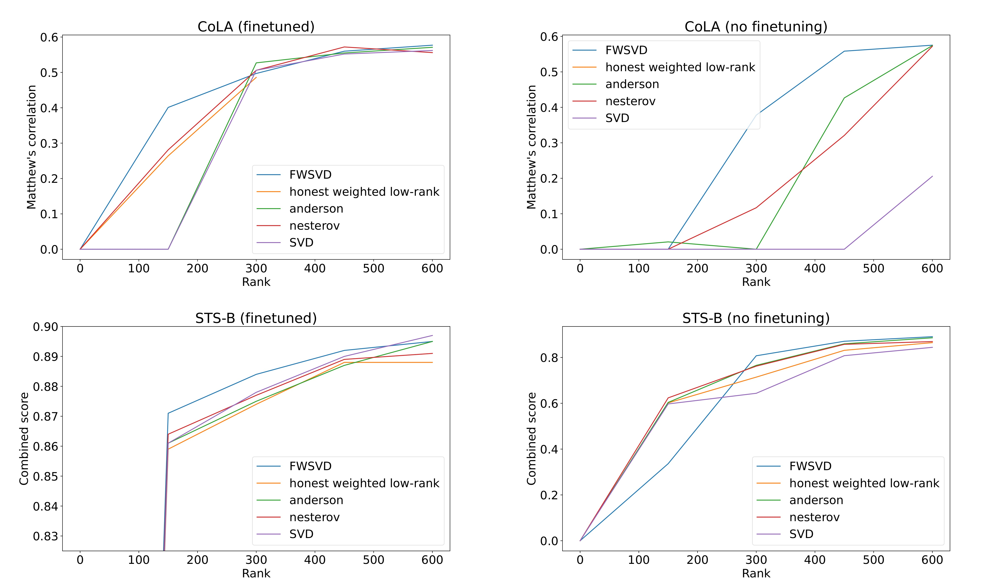

# Weighted Low-Rank Approximation for Transformer Compression.
**Final project for Skoltech NLA-2022 course.**

**Team members:** Seleznyov Mikhail, Galichin Andrey, Kovaleva Maria.

Responsibilities:
- Seleznyov: leading project, running experiments
- Galichin: implementing Fisher Weighted SVD
- Kovaleva: implementing accelerated algorithms, making presentation

## Setup

There are various ways to compress large language models. 
One of them is good old SVD, applied to weight matrices in linear layers. 
However, it treats all parameters equally.

Authors of paper [Large model compression with weighted low-rank factorization [1]](https://arxiv.org/pdf/2207.00112.pdf)
hypothesized, that some parameters are more important then others, and should be reconstructed more accurately. 
To address that, one could somehow compute the importance of each parameter and then use weighted low-rank approximation (WLRA).
A sane approach for parameter importance estimation is to use Fisher information matrix.

Unlike usual low-rank approximation, weighted low-rank approximation in general case does not have a closed-form solution.
In the paper authors made a simplifying assumption, that all parameters in one row of each weight matrix have the same importance, 
computed as a mean of corresponding row in Fisher information matrix. With that the task again reduces to applying SVD.

However, there are some iterative algorithms for weighted low-rank approximation, 
for example, described in papers [Weighted Low-Rank Approximations [2]](https://www.aaai.org/Papers/ICML/2003/ICML03-094.pdf) 
and [Weighted Low-Rank Approximation and Acceleration [3]](https://arxiv.org/pdf/2109.11057.pdf).
So we decided to check, if more accurate solution of weighted low-rank approximation helps to compress language models more efficiently.

## Results

We implemented SVD, default FWSVD and FWSVD with 3 iterative methods for solving WLRA.
`honest weighted low-rank` is the algorithm from [2], `nesterov` and `anderson` are accelerations of this algorithm, described in [3].

The plots show the dependence of target metric (higher is better) on the rank of approximation on two tasks from [GLUE](https://gluebenchmark.com/) benchmark.


Takeaways:
1. With finetuning, default FWSVD performs the best (however, on STS-B the difference is marginal).
2. Without finetuning, default FWSVD works worse than iterative methods on low rank (150) on STS-B task.

Also, `honest weighted low-rank` [2] turned out to be quite unstable in application to BERT weight matrices, that's why it is not present on the second plot and breaks off in the middle of the first plot.

## Example of usage

First, make a conda environment, using `environment.yaml` file:

```
conda env create --file environment.yaml
conda activate nlp
```

Then, to compress a model, you have to do something like this:

```
from transformers import AutoModelForSequenceClassification
from src.compress_bert import compute_nd_replace_dense

model = AutoModelForSequenceClassification.from_pretrained("bert-base-uncased")  # any BertModel is supported
dataloader = ...  # task-specific

for epoch in range(n_epochs):
    ... # train model

model = compute_nd_replace_dense(model, dataloader, rank=200)  # runs FWSVD compression

# you may try to use the model right away

# or finetune it
for epoch in range(n_epochs):
    ... # finetune model

```

### Sidenote

We used a script from a private repository of Skoltech NLP Lab. Unfortunately, we can't share it, and we didn't have time to reimplement it and rerun the experiments, since it is would take several days.

However, our implementation is not bounded to any specific training pipeline. So it is possible to adapt, for example, [this](https://github.com/huggingface/transformers/blob/main/examples/pytorch/text-classification/run_glue.py) script to incorporate FWSVD compression.